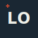

# Identity Kit — Lanre Odesanya

## Type

- **Heading font:** Space Grotesk
- **Body/label font:** IBM Plex Sans

## Palette

| Role | Hex |
|---|---|
| Main / near-black text | `#1A2733` |
| Near-white background | `#EDEEE7` |
| Accent (one only) | `#C1442E` |
| Structural neutral (hairlines/borders) | `#C9CCC2` |

## Logo / Favicon

"LO" monogram, set in Space Grotesk, ink text on paper background, with a small
crosshair mark echoing the site's recurring "checked/flagged" annotation motif.

## Style Note

Fonts: Space Grotesk for headings, IBM Plex Sans for body and labels. Colors:
`#1A2733` text on `#EDEEE7` background, `#C1442E` as the one accent for CTAs and
flagged findings.

Mood: quiet and verification-minded, like a spec sheet — calm enough that the case
studies stay the loudest thing on the page.
