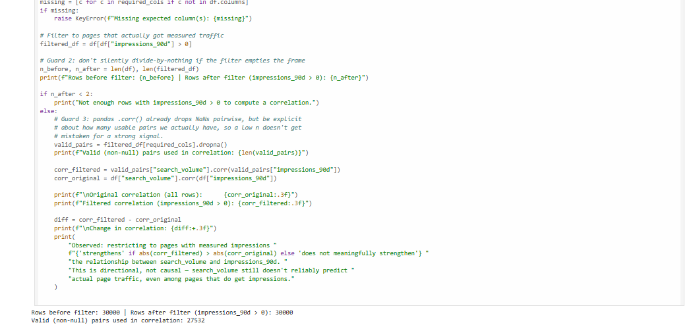
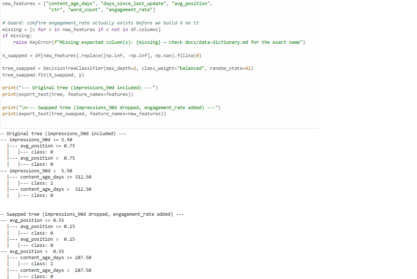

# Image Curation — Week 3

## Final Image Set (the keepers)

### 1. Discovery A output — Case Study page
Real capture (cropped screenshot of actual notebook output).

**Where I made the call:** used the real printed correlation/row-count output
instead of describing it in text alone — the numbers are the proof, not a
paraphrase of them.

### 2. Decision tree comparison — Case Study page
Real capture (cropped screenshot of actual notebook output).

**Where I made the call:** same reasoning — the literal printed tree structure is
what shows the finding (`engagement_rate` never appearing), not a summary of it.

### 3. About photo — About page
Real photo.

**Where I made the call:** kept a genuine, unstaged photo (casual setting, real
smile) rather than seeking a stiffer studio-style headshot — my voice card includes
"honest" and "supportive," not just "professional," and a real moment fits that
better than a posed one.

## Rejected

**A generated hero texture/pattern for the homepage**, matching the identity kit's
palette (ink/paper/flag-red).

**Why rejected:** even a well-matched generated image would become the most
visually interesting thing on the homepage, which directly fights the site's actual
goal — the identity kit's mood is "quiet, so the work is the loudest thing on the
page," and a generated hero image, however well-styled, competes with that. No
AI-generated images were used anywhere on the site.

## Where Real Beat Generated

Both case study images: an AI-generated "data visualization" mockup would have been
faster to produce and could have looked more polished, but it wouldn't have proven
anything — the entire claim of the case study is "I verify real results," so the
proof has to be the actual output, not an illustration of it.

## Notes on the Real Captures

The two case study screenshots were cleaned before use: cropped to remove a "Activate
Windows" watermark and any browser chrome, keeping only the code and its real printed
output.
